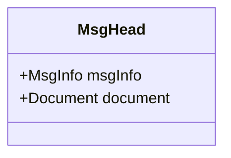
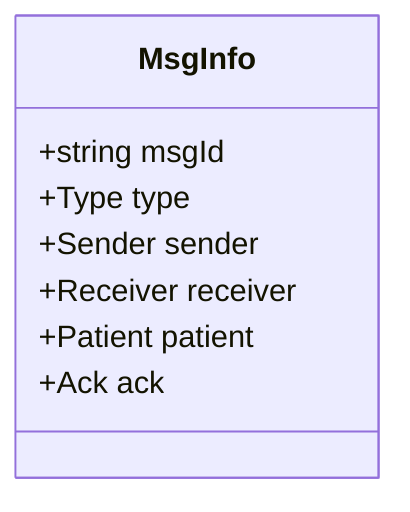
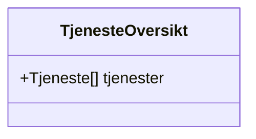
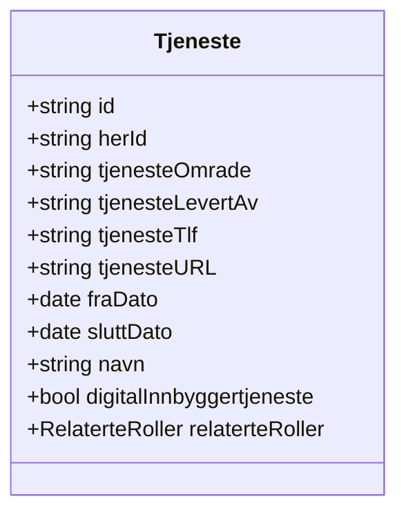
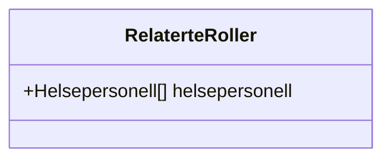
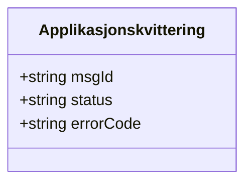

# Classes

Message header and payload models for AMQP Tjenesteoversikt.

- [MsgHead.mmd](MsgHead.mmd) – Hodemelding wrapper



- [MsgInfo.mmd](MsgInfo.mmd) – Header metadata



- [TjenesteOversikt.mmd](TjenesteOversikt.mmd) – Service overview container



- [Tjeneste.mmd](Tjeneste.mmd) – Individual service entry



**Fields, cardinality and notes**

- `id` : 1 — Local service identifier (logical id used by sender).
- `herId` : 1 — HER identifier used by Helsenorge. Maps to XML `<HERId>` with `<fk1:Id>` and `<fk1:TypeId V="HER" S="2.16.578.1.12.4.1.1.9051" DN="HER-id"/>`.
- `tjenesteOmrade` : 1 — Service category/type id (e.g. `1` = Kommunal helse og omsorg).
- `tjenesteLevertAv` : 0..1 — Provider name for the service.
- `tjenesteTlf` : 0..1 — Provider telephone (TeleAddress).
- `tjenesteURL` : 0..1 — Provider URL (TeleAddress url).
- `fraDato` (Startdato) : 1 — Date service starts; Helsekontakt becomes active from this date.
- `sluttDato` : 0..1 — Optional end date; Helsekontakt becomes inactive after this date.
- `navn` : 1 — Service name shown to the citizen.
- `digitalInnbyggertjeneste` : 1 — Whether service is a digital citizen service (boolean).
- `relaterteRoller` : 0..1 — Related personnel; fields inside (FamilyName, GivenName, Ident) are required if `relaterteRoller` is present.

Example XML excerpt (illustrative):

```xml
<Tjeneste>
	<TjenesteId>12</TjenesteId>
	<TjenesteNavn>Praktisk bistand</TjenesteNavn>
	<TjenesteOmrade>1</TjenesteOmrade>
	<TjenesteLevertAv>Leverandør A</TjenesteLevertAv>
	<TjenesteTlf>
		<fk1:TeleAddress V="tel:21802180"/>
	</TjenesteTlf>
	<TjenesteURL>
		<fk1:TeleAddress V="url:https://www.oslo.kommune.no/..."/>
	</TjenesteURL>
	<FraDato>2017-01-12</FraDato>
	<HERId>
		<fk1:Id>93971</fk1:Id>
		<fk1:TypeId V="HER" S="2.16.578.1.12.4.1.1.9051" DN="HER-id"/>
	</HERId>
	<RelaterteRoller>
		<!-- healthcare personnel entries -->
	</RelaterteRoller>
</Tjeneste>
```

Notes: cardinalities are taken from the specification examples in the AMQP Tjenesteoversikt PDF. Where `0..1` is shown the field is optional; `1` is required.

- [RelaterteRoller.mmd](RelaterteRoller.mmd) – Related personnel roles



- [Applikasjonskvittering.mmd](Applikasjonskvittering.mmd) – Application receipt


