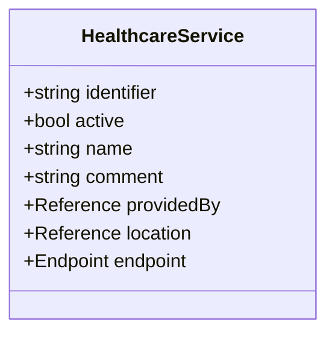
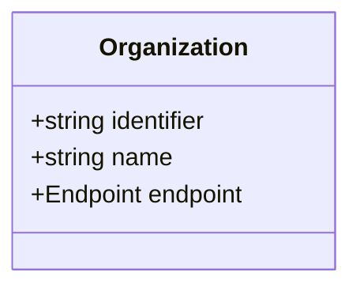
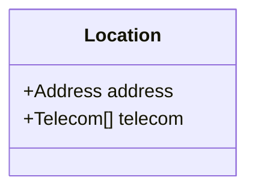
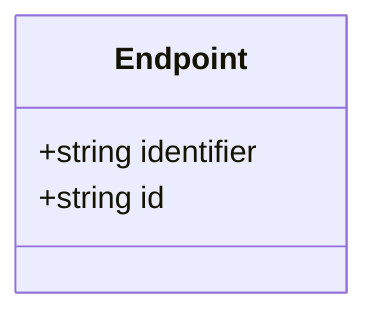
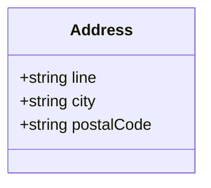
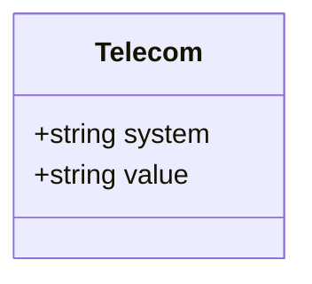
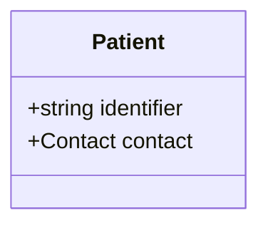
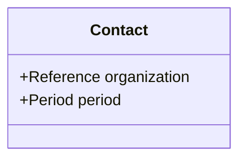
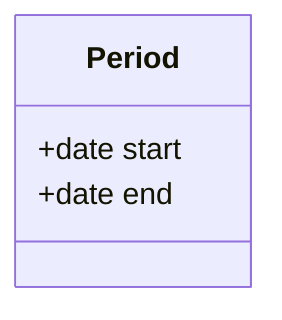

# Classes

FHIR resource snippets for Medlemstjenester (health offerings and member lists).

- [HealthcareService.mmd](HealthcareService.mmd) – Offered service



- [Organization.mmd](Organization.mmd) – Providing organization



- [Location.mmd](Location.mmd) – Service location



- [Endpoint.mmd](Endpoint.mmd) – Communication endpoint



- [Address.mmd](Address.mmd) – Postal address



- [Telecom.mmd](Telecom.mmd) – Contact points



- [Patient.mmd](Patient.mmd) – Member record



- [Contact.mmd](Contact.mmd) – Member contact linkage



- [Period.mmd](Period.mmd) – Service period



## Identifier notes and XML examples

- `Endpoint.identifier`: For communication endpoints the PDF shows a HER-id identifier is used. Example system/OID used in examples: `urn:oid:2.16.578.1.12.4.1.2` with a numeric HER-id value (often HER level 2 for service endpoints). Use this to populate `Endpoint.identifier.system` and `Endpoint.identifier.value` when sending `HealthcareService`.

Example (excerpt):

```xml
<endpoint>
	<identifier>
		<system value="urn:oid:2.16.578.1.12.4.1.2"/> <!-- HER-id -->
		<value value="129688"/>
	</identifier>
</endpoint>
```

- `Organization.identifier`: Organization identifiers are shown in examples with system `urn:oid:2.16.578.1.12.4.1.4.101` (organisation number) or similar OIDs; use these to link `HealthcareService.providedBy` and `Patient.contact.organization`.

Example (excerpt):

```xml
<Organization>
	<identifier>
		<system value="urn:oid:2.16.578.1.12.4.1.4.101"/>
		<value value="948554062"/>
	</identifier>
</Organization>
```

- `Patient.identifier`: Use national person identifier as shown in examples (system `urn:oid:2.16.578.1.12.4.1.4.1`).

Example (excerpt):

```xml
<Patient>
	<identifier>
		<system value="urn:oid:2.16.578.1.12.4.1.4.1"/> <!-- fødselsnummer/d-nummer -->
		<value value="13116900216"/>
	</identifier>
</Patient>
```
